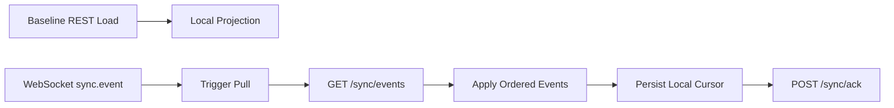
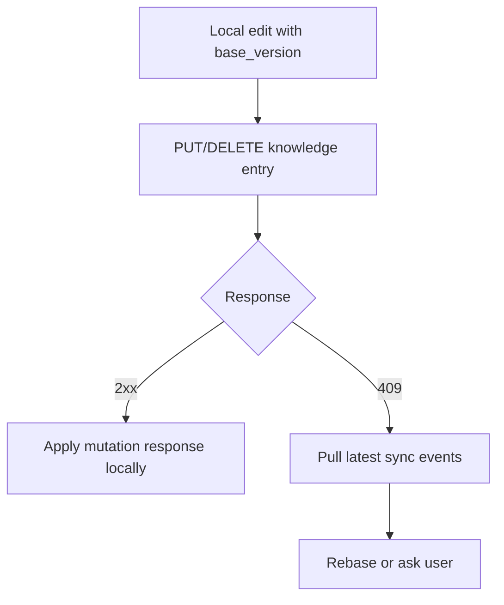

# AgentOS Client Sync Consumer Contract

Stage 5A handoff: [stage5a-client-integration-handoff.md](./stage5a-client-integration-handoff.md)

Updated: 2026-06-01  
Status: Stage 5A client-ready contract baseline

## 1. Purpose

This document defines how AgentOS clients and SDKs consume the backend cross-device sync contract.

The backend is the authoritative event sequencer. Clients own local durable application of events, local projections, and cursor persistence.

The client loop is:

1. load a baseline through domain APIs;
2. receive WebSocket sync notifications when online;
3. pull ordered sync events from `/api/v1/sync/events`;
4. apply events deterministically to local stores or the SDK bridge projection;
5. persist the applied cursor;
6. ack the backend only after durable local apply.

Stage 5A adds a general SDK / FFI reducer path for client-ready pull envelopes, beyond the older knowledge-only bridge.

## 2. Scope

In scope for Stage 5A client consumption:

- sync event envelope decoding;
- profile sync;
- message sync;
- skill settings sync;
- agent settings sync;
- server list sync;
- SAGE plugin lifecycle and permission sync;
- personal knowledge entry sync;
- cursor persistence and ack discipline;
- idempotent retry handling;
- optimistic concurrency conflict handling;
- offline catch-up;
- SDK / FFI bridge application of backend pull envelopes.

Out of scope:

- Federation / multi-server networking conflict semantics;
- generic external sync write endpoint;
- full CRDT/merge engine;
- Backend-side SAGE Flow execution;
- external payment-provider sync semantics.

## 3. Sync Model

Clients use a baseline + incremental model.



WebSocket notifications are hints. Pull remains the source of truth because it returns ordered, durable, per-user sequences.

## 4. Baseline APIs

| Object family | Baseline API | Notes |
|---|---|---|
| `profile` | `GET /api/v1/users/me` | Current authenticated user profile. |
| `conversation` / `participant` / `message` | `GET /api/v1/conversations`, `GET /api/v1/conversations/:id/messages` | Conversation list, membership, and history remain domain-loaded for baseline/repair. |
| `skill` | `GET /api/v1/skills/installations`, `GET /api/v1/skills/settings` | Skill Hub install library plus legacy user skill settings. |
| `agent` | `GET /api/v1/agents/settings` | User agent settings. |
| `server` | `GET /api/v1/servers` | User server connection list. Local configuration only; not Federation. |
| `plugin` | `GET /api/v1/sage/installations`, `GET /api/v1/sage/installations/:installation_id/policy-bundle` | SAGE installation and policy state. |
| `knowledge` | `GET /api/v1/knowledge/entries?include_deleted=true` | Include tombstones during reconciliation. |

## 5. Incremental Event API

Endpoint:

```http
GET /api/v1/sync/events?after_sequence=<last_applied_sequence>&limit=100
Authorization: Bearer <token>
```

Backend handler responses wrap the sync payload in the standard API response envelope:

```json
{
  "code": 0,
  "message": "ok",
  "data": {
    "events": [],
    "next_after_sequence": 123,
    "has_more": false,
    "server_time": 1780054321000,
    "schema_version": 1
  }
}
```

Client rules:

1. Treat events as ordered by `sequence`.
2. Ignore events with `sequence <= local_last_applied_sequence`.
3. Apply all events in sequence order.
4. If `has_more` is true, continue pulling from `next_after_sequence`.
5. Persist local cursor only after events are durably applied.
6. Ack only the latest durably applied sequence.

## 6. Ack API

Endpoint:

```http
POST /api/v1/sync/ack
Authorization: Bearer <token>
Content-Type: application/json

{"last_sequence": 123}
```

Ack discipline:

- Ack means: “this device has durably applied all events through this sequence.”
- Never ack before local persistence succeeds.
- Re-acking the same or lower sequence is safe; backend cursor advancement is monotonic.
- If local apply fails, do not ack. Retry pull/apply later.

## 7. WebSocket Notification Semantics

Server may notify non-source devices with:

```json
{
  "type": "sync.event",
  "payload": {
    "event_type": "knowledge.updated",
    "schema_version": 1,
    "object_type": "knowledge",
    "object_id": "notes/alpha",
    "operation": "updated",
    "source_device_id": "device-a",
    "client_event_id": "optional",
    "sequence": 12,
    "timestamp": 1780054321000,
    "payload": {}
  }
}
```

Client rules:

1. Treat notification as a hint, not the canonical event stream.
2. Trigger a pull from `/sync/events` using the local cursor.
3. Do not apply WebSocket payload directly unless the SDK explicitly shares the same ordered application path.
4. Source device may not receive its own sync notification. It should use the mutation response to update local state and cursor policy appropriate to the host.

## 8. Event Envelope Required Fields

Clients should decode and validate at least:

| Field | Required | Meaning |
|---|---:|---|
| `id` | yes | Server-generated event ID. |
| `user_id` | yes | Owner stream. |
| `event_type` | yes | `<object_type>.<operation>`. |
| `schema_version` | yes | Currently `1`. |
| `object_type` | yes | Domain family. |
| `object_id` | yes | Domain object ID. |
| `operation` | yes | Domain operation. |
| `source_device_id` | yes | Device that caused the event. |
| `client_event_id` | no | Client idempotency key. |
| `payload` | yes | Full or domain-specific event body. |
| `sequence` | yes | Per-user monotonic sequence. |
| `timestamp` | yes | Server event timestamp. |

If `schema_version` is unsupported, clients should stop applying that event stream and surface a compatibility error rather than silently corrupting local state.

## 9. Event Apply Rules by Object

### 9.1 Profile

Event: `profile.updated`

Apply rule:

```text
upsert local profile by user_id / object_id
set display_name/avatar_url from payload
record source sequence after durable write
```

### 9.2 Conversation and Participant

Supported events:

- `conversation.created`
- `conversation.updated`
- `conversation.read`
- `participant.added`
- `participant.updated`
- `participant.removed`

Apply rule:

```text
conversation.created/updated: upsert conversation by conversation_id / object_id
conversation.read: upsert actor-owned read cursor by conversation_id + user_id
participant.added/updated: upsert membership by conversation_id + user_id with status=active
participant.removed: tombstone/remove membership by conversation_id + user_id with status=removed
ignore duplicate object_id / sequence
```

Conversation membership and history should still be reconciled through baseline conversation APIs for cold start and repair.

### 9.3 Message

Supported events:

- `message.created`
- `message.updated`
- `message.deleted`
- `message.reaction_added`
- `message.reaction_removed`

Payload includes message identity and projection fields: `message_id`, `conversation_id`, `sender_id`, `type`, `content`, `metadata`, `reply_to`, `thread_id`, `visibility`, `status`, `created_at`, `edited_at`, `deleted_at`, and `deleted_by` when applicable. Reaction payloads include `message_id`, `conversation_id`, `user_id`, `emoji`, and `created_at`.

Apply rule:

```text
created/updated: upsert message by message_id / object_id
deleted: tombstone local message by object_id, preserving message identity and sequence history
ignore duplicate message_id / sequence
```

### 9.4 Skill Hub and Skill Settings

Events:

- `skill.installed`
- `skill.uninstalled`
- `skill.enabled`
- `skill.disabled`
- `skill.updated`

Apply rule:

```text
if payload contains installation_id:
  upsert Skill Hub installation by installation_id / object_id
  set skill_id, skill_key, version_id, track_mode, status, config from payload
  for uninstalled events, mark status=uninstalled
  for disabled events, mark status=disabled
  for enabled/installed events, mark status=active
else:
  legacy path: upsert skill setting by skill_id / object_id
  set enabled/config fields from payload
  for disabled events, set enabled=false
```

### 9.5 Agent Settings

Event: `agent.updated`

Apply rule:

```text
upsert agent setting by agent_id / object_id
replace config fields from payload
```

### 9.6 Server List

Events:

- `server.added`
- `server.updated`
- `server.removed`

Apply rule:

```text
server.added: upsert server connection by server connection id
server.updated: replace server connection by id if present; otherwise upsert
server.removed: delete or tombstone local server connection by id
```

Server list sync is local user configuration only. It does not imply Federation, server trust, remote plugin discovery, or cross-server data sync.

### 9.7 SAGE Plugin Lifecycle and Permissions

Events:

- `plugin.installed`
- `plugin.uninstalled`
- `plugin.enabled`
- `plugin.disabled`
- `plugin.permission_granted`
- `plugin.permission_revoked`

Apply rule:

```text
plugin.installed/enabled/disabled/updated: upsert plugin installation by installation_id / object_id
plugin.uninstalled/removed: remove installation and associated permission grants
plugin.permission_granted: upsert grant by grant_id, falling back to installation_id:permission_key
plugin.permission_revoked: remove grant by grant_id, falling back to installation_id:permission_key
```

Client runtime should treat plugin sync state as installation / authorization state only. Runtime execution still depends on fresh policy bundle retrieval:

```http
GET /api/v1/sage/installations/:installation_id/policy-bundle
```

### 9.7 Personal Knowledge Entries

Events:

- `knowledge.created`
- `knowledge.updated`
- `knowledge.deleted`

Payload fields:

- `object_id`
- `entry_id`
- `title`
- `content_markdown`
- `summary`
- `tags`
- `metadata`
- `source_uri`
- `status`
- `version`
- `content_hash`
- `updated_by_device_id`
- `updated_at`
- `deleted_at` when deleted

Apply rule:

```text
let local = local entry by entry_id

if no local:
    insert payload as local entry, including tombstone state

if local exists and payload.version > local.version:
    replace local entry with payload

if local exists and payload.version == local.version:
    if content_hash/status match: treat as duplicate
    else surface local consistency error

if local exists and payload.version < local.version:
    ignore stale event
```

Delete rule:

```text
knowledge.deleted is a tombstone, not a physical delete.
store status=deleted, version, content_hash, deleted_at.
active views hide tombstones unless include_deleted/reconciliation mode is enabled.
```

## 10. SDK / FFI Bridge Contract

Stage 5A client-ready reducer lives in the Rust SDK:

- crate: `agentos-client-bridge`
- projection: `ClientReadySyncProjection`
- Rust helper: `apply_sync_pull_response_json(projection_json, pull_response_json)`
- FFI export: `agentos_apply_sync_pull_response_json`

The FFI function accepts:

1. `projection_json`: serialized `ClientReadySyncProjection`, or empty string for a new projection;
2. `pull_response_json`: standard backend `/api/v1/sync/events` response envelope.

It returns a JSON-encoded bridge response:

```json
{
  "ok": true,
  "json": "{...serialized ClientReadySyncProjection...}"
}
```

The projection contains:

- `cursor.last_applied_sequence`
- `knowledge`
- `profiles`
- `messages`
- `skills`
- `agents`
- `servers`
- `plugins`
- `plugin_permissions`

Backend evidence fixture:

```text
internal/service/testdata/stage5a_client_ready_sync_pull_response.json
```

Backend FFI integration test:

```text
internal/service/ffi_verifier_test.go
TestFFIClientReadySyncBridgeIntegration
```

Smoke:

```bash
./scripts/smoke-stage5a-sync-bridge.sh
```

This smoke is part of `./scripts/release-gate-local.sh`.

## 11. Client-Originated Writes

Mutating requests should include `client_event_id` whenever possible.

Example:

```json
{
  "entry_id": "notes/alpha",
  "title": "Alpha",
  "content_markdown": "# Alpha",
  "client_event_id": "device-a-uuid-1"
}
```

Client rules:

1. Generate a stable unique `client_event_id` per attempted logical write.
2. Reuse the same `client_event_id` when retrying the same logical write after network failure.
3. Never reuse a `client_event_id` for a different object, operation, or source device.
4. If backend returns idempotent replay, treat it as success.
5. If backend returns idempotency conflict, stop retrying and surface a client bug or local queue corruption error.

## 12. Optimistic Concurrency for Knowledge

Knowledge update/delete requests may include `base_version`.

```json
{
  "title": "Alpha v2",
  "content_markdown": "# Alpha v2",
  "base_version": 1,
  "client_event_id": "device-a-uuid-2"
}
```

Backend behavior:

- if `base_version == current.version`: write succeeds;
- if stale: returns `409 conflict`, does not mutate entry, and records no sync event.

Client conflict flow:



Stage 5A does not require automatic semantic merge. A host may choose last-writer review, manual diff, or local draft preservation.

## 13. Offline Catch-up

When a device reconnects:

1. load durable local cursor;
2. call `/sync/events?after_sequence=<cursor>`;
3. apply events in order;
4. continue while `has_more=true`;
5. persist local cursor;
6. ack latest applied sequence.

If the device has queued local writes, prefer this order:

1. pull remote events;
2. apply remote events;
3. revalidate queued local writes against local versions;
4. submit writes with `base_version` and `client_event_id`;
5. handle conflicts explicitly.

## 14. Local Reducer Requirements

A compliant client reducer must be:

- deterministic: same event prefix produces same local projection;
- idempotent: duplicate events do not duplicate local objects;
- version-aware for knowledge entries;
- tombstone-aware for knowledge deletes;
- cursor-safe: no ack before durable apply;
- compatibility-aware: unsupported schema versions stop apply.

## 15. Required SDK / Backend Tests

Minimum SDK/client tests:

1. decode sync envelope schema version 1;
2. reject unsupported schema version;
3. ignore duplicate or already-applied sequence;
4. apply `profile.updated`;
5. apply `conversation.created`, `conversation.updated`, `conversation.read`, `participant.added`, `participant.updated`, and `participant.removed` idempotently;
6. apply `message.created`, `message.updated`, `message.deleted`, `message.reaction_added`, and `message.reaction_removed` idempotently;
7. apply `skill.installed`, `skill.uninstalled`, `skill.enabled`, `skill.disabled`, `skill.updated`;
8. apply `agent.updated`;
9. apply `server.added`, `server.updated`, `server.removed`;
9. apply `plugin.installed`, `plugin.uninstalled`, `plugin.enabled`, `plugin.disabled`;
10. apply `plugin.permission_granted`, `plugin.permission_revoked`;
11. apply `knowledge.created`;
12. apply `knowledge.updated` only when version is newer;
13. apply `knowledge.deleted` as tombstone;
14. ignore stale knowledge events;
15. detect same-version content/status mismatch;
16. persist cursor only after reducer success;
17. retry same `client_event_id` as same logical write;
18. surface idempotency conflict as client/local queue error;
19. handle stale `base_version` by pulling latest events.

Backend Stage 5A evidence:

```bash
./scripts/smoke-stage5a-sync-bridge.sh
go test ./internal/service -run 'TestFFIClientReadySyncBridgeIntegration' -count=1 -v
```

## 16. Stage 5A Gate

Client-ready sync is acceptable when:

- backend emits stable schema-versioned sync envelopes;
- SDK bridge can apply pull envelopes for profile/message/skill/agent/server/plugin/knowledge;
- FFI export is present in bundled runtime libraries;
- smoke and release gate pass;
- clients ack only after durable local apply.
