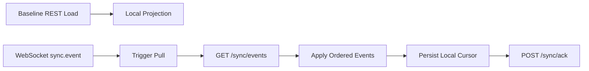
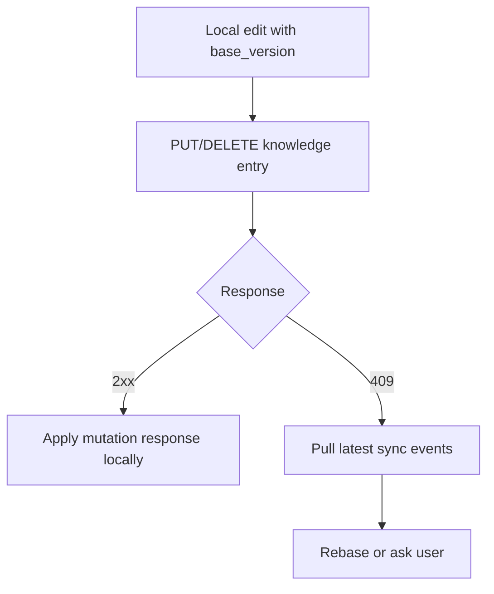

# AgentOS Client Sync Consumer Contract

Updated: 2026-05-30
Branch: `m2-3-client-sync-integration`
Status: Draft for M2.3 SDK/client integration

## 1. Purpose

This document defines how AgentOS clients and SDKs should consume the backend cross-device sync contract.

The backend is the authoritative event sequencer. Clients own local durable application of events, local projections, and cursor persistence.

M2.3 turns the backend M2.2 sync foundation into a real multi-device loop:

1. load a baseline through domain APIs;
2. receive WebSocket sync notifications when online;
3. pull ordered sync events from `/api/v1/sync/events`;
4. apply events deterministically to local stores;
5. persist the applied cursor;
6. ack the backend only after durable local apply.

## 2. Scope

In scope for M2.3 client consumption:

- sync event envelope decoding;
- profile sync;
- message sync;
- skill settings sync;
- agent settings sync;
- server list sync;
- personal knowledge entry sync;
- cursor persistence and ack discipline;
- idempotent retry handling;
- optimistic concurrency conflict handling;
- offline catch-up.

Out of scope for M2.3:

- KB Hub publishing, snapshots, subscriptions, marketplace discovery, semantic indexing, billing, and search;
- generic external sync write endpoint;
- multi-server federation conflict semantics;
- full CRDT/merge engine;
- plugin marketplace / SAGE sync semantics beyond reserved taxonomy.

## 3. Sync Model

Clients use a baseline + incremental model.



WebSocket notifications are hints. Pull remains the source of truth because it returns ordered, durable, per-user sequences.

## 4. Baseline APIs

| Object family | Baseline API | Notes |
|---|---|---|
| `profile` | `GET /api/v1/users/me` | Current authenticated user profile. |
| `message` | `GET /api/v1/conversations`, `GET /api/v1/conversations/:id/messages` | Conversation history remains domain-loaded. |
| `skill` | `GET /api/v1/skills/settings` | User skill settings. |
| `agent` | `GET /api/v1/agents/settings` | User agent settings. |
| `server` | `GET /api/v1/servers` | User server connection list. |
| `knowledge` | `GET /api/v1/knowledge/entries?include_deleted=true` | Clients should include tombstones during reconciliation. |

## 5. Incremental Event API

Endpoint:

```http
GET /api/v1/sync/events?after_sequence=<last_applied_sequence>&limit=100
Authorization: Bearer <token>
```

Response envelope:

```json
{
  "events": [],
  "next_after_sequence": 123,
  "has_more": false,
  "server_time": 1780054321000,
  "schema_version": 1
}
```

Client rules:

1. Treat events as ordered by `sequence`.
2. Ignore events with `sequence <= local_last_applied_sequence`.
3. Apply all events in sequence order.
4. If `has_more` is true, continue pulling from `next_after_sequence`.
5. Persist local cursor only after events are durably applied.
6. Ack only the latest durably applied sequence.

## 6. Ack API

Endpoint:

```http
POST /api/v1/sync/ack
Authorization: Bearer <token>
Content-Type: application/json

{"last_sequence": 123}
```

Ack discipline:

- Ack means: “this device has durably applied all events through this sequence.”
- Never ack before local persistence succeeds.
- Re-acking the same or lower sequence is safe; backend cursor advancement is monotonic.
- If local apply fails, do not ack. Retry pull/apply later.

## 7. WebSocket Notification Semantics

Server may notify non-source devices with:

```json
{
  "type": "sync.event",
  "payload": {
    "event_type": "knowledge.updated",
    "schema_version": 1,
    "object_type": "knowledge",
    "object_id": "notes/alpha",
    "operation": "updated",
    "source_device_id": "device-a",
    "client_event_id": "optional",
    "sequence": 12,
    "timestamp": 1780054321000,
    "payload": {}
  }
}
```

Client rules:

1. Treat notification as a hint, not the canonical event stream.
2. Trigger a pull from `/sync/events` using the local cursor.
3. Do not apply WebSocket payload directly unless the SDK explicitly shares the same ordered application path.
4. Source device may not receive its own sync notification. It should use the mutation response to update local state and cursor policy appropriate to the host.

## 8. Event Envelope Required Fields

Clients should decode and validate at least:

| Field | Required | Meaning |
|---|---:|---|
| `id` | yes | Server-generated event ID. |
| `user_id` | yes | Owner stream. |
| `event_type` | yes | `<object_type>.<operation>`. |
| `schema_version` | yes | Currently `1`. |
| `object_type` | yes | Domain family. |
| `object_id` | yes | Domain object ID. |
| `operation` | yes | Domain operation. |
| `source_device_id` | yes | Device that caused the event. |
| `client_event_id` | no | Client idempotency key. |
| `payload` | yes | Full or domain-specific event body. |
| `sequence` | yes | Per-user monotonic sequence. |
| `timestamp` | yes | Server event timestamp. |

If `schema_version` is unsupported, clients should stop applying that event stream and surface a compatibility error rather than silently corrupting local state.

## 9. Event Apply Rules by Object

### 9.1 Profile

Event: `profile.updated`

Minimum payload fields:

- `user_id`
- `display_name`
- `avatar_url`
- `updated_at`

Apply rule:

```text
upsert local profile by user_id
set display_name/avatar_url from payload
record source sequence as last applied after durable write
```

### 9.2 Message

Event: `message.created`

Minimum payload fields:

- `message_id`
- `conversation_id`
- `sender_id`
- `type`
- `content`
- `metadata`
- `created_at`

Apply rule:

```text
upsert message by message_id
attach to conversation_id
ignore duplicate message_id
```

Conversation membership and history should still be reconciled through baseline conversation APIs.

### 9.3 Skill Settings

Events:

- `skill.enabled`
- `skill.disabled`
- `skill.updated`

Apply rule:

```text
upsert skill setting by skill_id
set enabled/config fields from payload
for disabled events, set enabled=false
```

### 9.4 Agent Settings

Event: `agent.updated`

Apply rule:

```text
upsert agent setting by agent_id
replace config fields from payload
```

### 9.5 Server List

Events:

- `server.added`
- `server.updated`
- `server.removed`

Apply rule:

```text
server.added: upsert server connection by server connection id
server.updated: replace server connection by id if present; otherwise upsert
server.removed: delete or tombstone local server connection by id
```

### 9.6 Personal Knowledge Entries

Events:

- `knowledge.created`
- `knowledge.updated`
- `knowledge.deleted`

Payload fields:

- `object_id`
- `entry_id`
- `title`
- `content_markdown`
- `summary`
- `tags`
- `metadata`
- `source_uri`
- `status`
- `version`
- `content_hash`
- `updated_by_device_id`
- `updated_at`
- `deleted_at` when deleted

Apply rule:

```text
let local = local entry by entry_id

if no local:
    insert payload as local entry, including tombstone state

if local exists and payload.version > local.version:
    replace local entry with payload

if local exists and payload.version == local.version:
    if content_hash/status match: treat as duplicate
    else surface local consistency error

if local exists and payload.version < local.version:
    ignore stale event
```

Delete rule:

```text
knowledge.deleted is a tombstone, not a physical delete.
store status=deleted, version, content_hash, deleted_at.
active views hide tombstones unless include_deleted/reconciliation mode is enabled.
```

## 10. Client-Originated Writes

Mutating requests should include `client_event_id` whenever possible.

Examples:

```json
{
  "entry_id": "notes/alpha",
  "title": "Alpha",
  "content_markdown": "# Alpha",
  "client_event_id": "device-a-uuid-1"
}
```

Client rules:

1. Generate a stable unique `client_event_id` per attempted logical write.
2. Reuse the same `client_event_id` when retrying the same logical write after network failure.
3. Never reuse a `client_event_id` for a different object, operation, or source device.
4. If backend returns idempotent replay, treat it as success.
5. If backend returns idempotency conflict, stop retrying and surface a client bug or local queue corruption error.

## 11. Optimistic Concurrency for Knowledge

Knowledge update/delete requests may include `base_version`.

```json
{
  "title": "Alpha v2",
  "content_markdown": "# Alpha v2",
  "base_version": 1,
  "client_event_id": "device-a-uuid-2"
}
```

Backend behavior:

- if `base_version == current.version`: write succeeds;
- if stale: returns `409 conflict`, does not mutate entry, and records no sync event.

Client conflict flow:



M2.3 does not require automatic semantic merge. A host may choose last-writer review, manual diff, or local draft preservation.

## 12. Offline Catch-up

When a device reconnects:

1. load durable local cursor;
2. call `/sync/events?after_sequence=<cursor>`;
3. apply events in order;
4. continue while `has_more=true`;
5. persist local cursor;
6. ack latest applied sequence.

If the device has queued local writes, prefer this order:

1. pull remote events;
2. apply remote events;
3. revalidate queued local writes against local versions;
4. submit writes with `base_version` and `client_event_id`;
5. handle conflicts explicitly.

## 13. Local Reducer Requirements

A compliant client reducer must be:

- deterministic: same event prefix produces same local projection;
- idempotent: duplicate events do not duplicate local objects;
- version-aware for knowledge entries;
- tombstone-aware for knowledge deletes;
- cursor-safe: no ack before durable apply;
- compatibility-aware: unsupported schema versions stop apply.

## 14. M2.3 Required SDK Tests

Minimum SDK/client tests:

1. decode sync envelope schema version 1;
2. reject unsupported schema version;
3. ignore duplicate or already-applied sequence;
4. apply `profile.updated`;
5. apply `message.created` idempotently;
6. apply `skill.enabled`, `skill.disabled`, `skill.updated`;
7. apply `agent.updated`;
8. apply `server.added`, `server.updated`, `server.removed`;
9. apply `knowledge.created`;
10. apply `knowledge.updated` only when version is newer;
11. apply `knowledge.deleted` as tombstone;
12. ignore stale knowledge events;
13. detect same-version content/status mismatch;
14. persist cursor only after reducer success;
15. retry same `client_event_id` as same logical write;
16. surface idempotency conflict as client/local queue error;
17. handle stale `base_version` by pulling latest events.

## 15. Backend E2E Smoke Required Before M3

Before starting KB Hub implementation, the backend should have a live two-device smoke that proves:

1. two authenticated devices under one user;
2. Device A writes knowledge entry;
3. Device B receives WebSocket hint or pulls manually;
4. Device B applies `knowledge.created`;
5. Device A updates entry with `base_version`;
6. Device B pulls and applies `knowledge.updated`;
7. Device B attempts stale update and receives `409`;
8. Device A deletes entry;
9. Device B pulls tombstone;
10. Device B acks final sequence.

## 16. M3 Gate

KB Hub design and implementation should stay blocked until:

- backend M2.2 tests pass;
- Postgres migration smoke passes;
- SDK/client reducer contract is implemented or at least test-specified;
- two-device sync smoke passes;
- knowledge tombstone and stale conflict behavior are accepted by the client integration layer.
