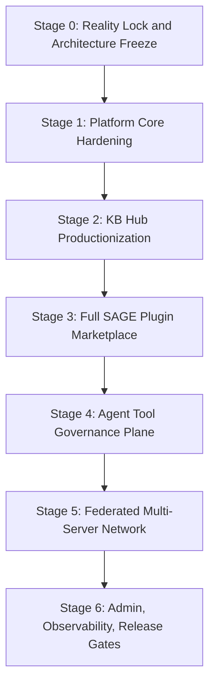

# AgentOS Backend Platform Roadmap

Updated: 2026-05-31
Status: Stage 0 architecture baseline
Scope: AgentOS Server platform completion, not MVP delivery

## 1. Direction

AgentOS Backend is no longer treated as a sequence of isolated MVP slices. The target is a complete federated AgentOS server platform with stable architecture, complete data boundaries, governance, auditability, billing, KB Hub, SAGE plugin marketplace, semantic search, and federation.

“Step into final form” means:

- architecture boundaries are decided up front;
- platform data model is planned as a whole;
- security/governance/audit are first-class subsystems, not later patches;
- implementation still proceeds in testable stages with fresh verification evidence.

## 2. Current Baseline

Fresh local verification before this roadmap:

```text
Backend: go test ./...
Result: 122 passed in 11 packages

Rust SDK: cargo test --workspace --all-targets --locked
Result: 1560 passed, 2 ignored, 110 suites
```

Current backend implementation includes:

- Identity challenge/verify through Ed25519 and the configured signature verifier.
- Rust FFI identity verifier path via `agentos-ffi` / `identity-core`.
- Admission policy foundation and admin admission routes.
- QR-only device pairing.
- Conversation, message persistence, offline message foundation, and WebSocket dispatcher.
- Sync event stream, cursors, per-user sequence allocation, idempotency keys, and pull/ack API.
- Sync object coverage for profile, message, skill, agent, server list, and personal knowledge entries.
- Personal knowledge entry tombstone, version, content hash, idempotency, and optimistic conflict semantics.
- MinIO-backed object storage foundation with `object_records` and upload/complete/download/delete lifecycle.
- KB Hub collection/snapshot publishing, immutable snapshot metadata, manifest/content object storage, public discovery, install/subscription, installed access, fulltext fetch, usage records, billing ledger foundation, contributor earnings foundation, lexical search, and async semantic search pipeline.
- PostgreSQL + pgvector semantic storage, durable embedding queue, deterministic embedding provider, local HTTP embedding worker contract, and Go embedding job worker.

Current known major gaps:

- Plugin Marketplace / SAGE routes are not implemented.
- Plugin data types exist in Go model definitions but are not yet a coherent product subsystem.
- Multi-server federation is not implemented beyond local user server-list sync.
- Governance/policy/audit is not yet a platform-wide control plane.
- Production observability, admin operations, release gates, and background job unification are incomplete.
- KB Hub production governance, moderation, version lifecycle, billing completion, and chunk-level search quality are incomplete.

## 3. Platform Completion Stages



## 4. Stage 0 — Reality Lock and Architecture Freeze

Goal: align code, documentation, migrations, tests, and roadmap before large feature expansion.

Deliverables:

- `docs/platform-roadmap.md`
- `docs/system-capability-matrix.md`
- `docs/architecture-boundaries.md`
- updated README / status references
- clean or intentionally documented git working tree state

Acceptance criteria:

- Current implemented capabilities are documented against real code.
- Planned platform capabilities are listed without pretending they exist.
- Architecture boundaries are explicit.
- Verification commands and current evidence are recorded.

## 5. Stage 1 — Platform Core Hardening

Goal: harden existing identity, sync, WebSocket, and operational foundations into platform-grade primitives.

Primary workstreams:

1. Identity and sensitive operations
   - password setup/change/confirmation;
   - device revoke/rename/trust state;
   - admin bootstrap;
   - admission audit events.

2. Sync completeness
   - plugin and federation-related sync event taxonomy;
   - schema version compatibility policy;
   - sync snapshot/repair API;
   - event compaction and retention strategy.

3. WebSocket and IM completion
   - conversation lifecycle events;
   - attachment-backed rich message types;
   - participant events;
   - Agent participant attribution and cards.

4. Operational baseline
   - request IDs;
   - structured logs;
   - readiness endpoint;
   - background cleanup tasks for pending objects and expired sessions.

## 6. Stage 2 — KB Hub Productionization

Goal: turn KB Hub from a functional subsystem into a governable knowledge economy platform.

Primary workstreams:

1. Real semantic search operational gate
   - deterministic semantic smoke remains CI-safe;
   - real BGE-M3 worker path is live-smoked and documented;
   - embedding status/retry operations are admin-ready.

2. KB governance and moderation
   - collection review;
   - takedown;
   - report abuse;
   - contributor profile and verification;
   - source/copyright declarations.

3. Version lifecycle
   - snapshot diff;
   - archive/restore;
   - subscriber impact preview;
   - version cleanup policy.

4. Search quality
   - chunk-level search documents;
   - passage embeddings;
   - hybrid reranking;
   - query logs and feedback;
   - search evaluation fixtures.

5. Billing completion
   - plans, invoices, invoice items;
   - payout ledger;
   - refund/dispute records;
   - platform fee policy.

## 7. Stage 3 — Full SAGE Plugin Marketplace

Goal: implement the plugin economy and SAGE protocol as complete server-side product surfaces.

Primary workstreams:

1. Plugin registry
   - developer profiles;
   - plugin metadata;
   - semantic version records;
   - package/icon object storage;
   - statuses: draft, submitted, under_review, approved, rejected, suspended, deprecated, archived.

2. Manifest contract
   - Tool Manifest schema;
   - capability declarations;
   - privacy declarations;
   - billing declarations;
   - output schema and risk metadata.

3. Review workflow
   - manifest validation;
   - injection scan;
   - typosquatting scan;
   - capability/risk review;
   - admin approval/rejection/revocation.

4. Installation and grants
   - user installation;
   - capability grants/revocation;
   - plugin enable/disable sync events;
   - installed plugin listing.

5. SAGE flow engine
   - Flow Definition;
   - step state;
   - approval gates;
   - execution report ledger;
   - usage/billing integration.

## 8. Stage 4 — Agent Tool Governance Plane

Goal: create the policy/audit/security control plane used by SAGE, KB, federation, and future action systems.

Primary workstreams:

- capability taxonomy;
- risk model;
- policy decisions: allow, require_user_approval, require_admin_approval, deny;
- tool definition scanning;
- response inspection;
- approval receipts;
- append-only audit log and hash chain;
- security incidents;
- kill switches by plugin, user, capability, or server.

This stage is deliberately placed after SAGE registry design but before allowing broad real tool execution.

## 9. Stage 5 — Federated Multi-Server Network

Goal: upgrade the current local server-list sync into actual AgentOS server federation.

Primary workstreams:

- server identity and public keys;
- `.well-known/agentos-server.json`;
- federation capability discovery;
- server handshake;
- remote server trust score;
- federated KB metadata discovery;
- federated plugin metadata discovery;
- remote install references;
- local policy gate for all remote resources.

Non-goal: cross-server strong consistency or hidden database replication.

## 10. Stage 6 — Admin, Observability, Release Gates

Goal: make the backend long-running, governable, and releaseable.

Primary workstreams:

- admin APIs for identity, admission, KB, plugins, billing, federation, jobs, audit, security, and health;
- unified background job system;
- structured logging and request IDs;
- metrics and readiness;
- migration gate;
- full smoke suite;
- release gate script.

Required release checks:

```text
go test ./...
PostgreSQL migration apply check
object storage smoke
KB full smoke
semantic search deterministic smoke
real embedding worker health smoke when enabled
SAGE marketplace smoke
policy governance smoke
federation handshake smoke
audit hash-chain smoke
```

## 11. Immediate Next Work After Stage 0

The next implementation stage should start with Platform Core Hardening, but SAGE design should be prepared in parallel because governance and plugin models affect sync taxonomy, billing, audit, and federation.

Recommended first implementation targets after Stage 0:

1. admin bootstrap + admission/device audit events;
2. sensitive-operation password confirmation;
3. platform-wide audit event foundation;
4. SAGE/Governance schema design docs before code.
