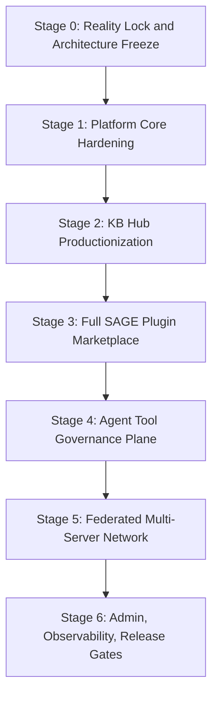

# AgentOS Backend Platform Roadmap

Updated: 2026-05-31
Status: Stage 0 architecture baseline
Scope: AgentOS Server platform completion, not MVP delivery

## 1. Direction

AgentOS Backend is no longer treated as a sequence of isolated MVP slices. The target is a complete federated AgentOS server platform with stable architecture, complete data boundaries, governance, auditability, billing, KB Hub, SAGE plugin marketplace, semantic search, and federation.

“Step into final form” means:

- architecture boundaries are decided up front;
- platform data model is planned as a whole;
- security/governance/audit are first-class subsystems, not later patches;
- implementation still proceeds in testable stages with fresh verification evidence.

## 2. Current Baseline

Fresh local verification before this roadmap:

```text
Backend: go test ./...
Result: 150 passed in 11 packages

Rust SDK: cargo test --workspace --all-targets --locked
Result: 1560 passed, 2 ignored, 110 suites
```

Current backend implementation includes:

- Identity challenge/verify through Ed25519 and the configured signature verifier.
- Rust FFI identity verifier path via `agentos-ffi` / `identity-core`.
- Admission policy foundation and admin admission routes.
- QR-only device pairing.
- Conversation, message persistence, offline message foundation, and WebSocket dispatcher.
- Sync event stream, cursors, per-user sequence allocation, idempotency keys, and pull/ack API.
- Sync object coverage for profile, message, skill, agent, server list, and personal knowledge entries.
- Personal knowledge entry tombstone, version, content hash, idempotency, and optimistic conflict semantics.
- MinIO-backed object storage foundation with `object_records` and upload/complete/download/delete lifecycle.
- KB Hub collection/snapshot publishing, immutable snapshot metadata, manifest/content object storage, public discovery, install/subscription, installed access, fulltext fetch, usage records, billing ledger foundation, contributor earnings foundation, lexical search, and async semantic search pipeline.
- PostgreSQL + pgvector semantic storage, durable embedding queue, deterministic embedding provider, local HTTP embedding worker contract, and Go embedding job worker.

Current known major gaps:

- SAGE Plugin Open Platform backend foundation is implemented: registry, manifest validation, review/catalog, installation/grants, policy bundle, invocation/report, and developer metrics.
- SAGE runtime/control-plane smoke is implemented via `scripts/smoke-sage-plugin-runtime.sh`; plugin lifecycle/permission state sync and icon/package object bindings are implemented. Remaining SAGE gaps are richer governance scanning and production policy operations.
- Multi-server federation is not implemented beyond local user server-list sync.
- Governance/policy/audit is not yet a platform-wide control plane.
- Production observability is still incomplete; admin operations, release gates, and background job unification now have a Stage 3A foundation via background job run history, admin ops APIs, and `scripts/release-gate-local.sh`.
- KB Hub now has a Stage 2 productionization foundation for review/takedown/reporting, source/copyright declarations, snapshot archive/restore/diff, subscription expiry cleanup, per-plan entitlement modes, invoice/refund/dispute records, payout period aggregation, and a unified background job runner; remaining gaps are real payment integration, tax/export operations, renewal collection policy, and chunk-level search quality.

## 3. Platform Completion Stages



## 4. Stage 0 — Reality Lock and Architecture Freeze

Goal: align code, documentation, migrations, tests, and roadmap before large feature expansion.

Deliverables:

- `docs/platform-roadmap.md`
- `docs/system-capability-matrix.md`
- `docs/architecture-boundaries.md`
- updated README / status references
- clean or intentionally documented git working tree state

Acceptance criteria:

- Current implemented capabilities are documented against real code.
- Planned platform capabilities are listed without pretending they exist.
- Architecture boundaries are explicit.
- Verification commands and current evidence are recorded.

## 5. Stage 1 — Platform Core Hardening

Goal: harden existing identity, sync, WebSocket, and operational foundations into platform-grade primitives.

Primary workstreams:

1. Identity and sensitive operations
   - password setup/change/confirmation;
   - device revoke/rename/trust state;
   - admin bootstrap;
   - admission audit events.

2. Sync completeness
   - plugin and federation-related sync event taxonomy;
   - schema version compatibility policy;
   - sync snapshot/repair API;
   - event compaction and retention strategy.

3. WebSocket and IM completion
   - conversation lifecycle events;
   - attachment-backed rich message types;
   - participant events;
   - Agent participant attribution and cards.

4. Operational baseline
   - request IDs;
   - structured logs;
   - readiness endpoint;
   - background cleanup tasks for pending objects and expired sessions.

## 6. Stage 2 — KB Hub Productionization

Goal: turn KB Hub from a functional subsystem into a governable knowledge economy platform.

Completed Stage 2 foundation:

1. KB governance and moderation
   - source and copyright declarations on collections;
   - collection review statuses: pending, approved, rejected, takedown, archived;
   - admin review/takedown API;
   - user report API;
   - admin moderation report list/resolve API;
   - audit events for review, report, snapshot lifecycle, and subscription expiry.

2. Version lifecycle
   - snapshot status: active / archived;
   - snapshot archive/restore APIs;
   - latest public snapshot ignores archived snapshots;
   - snapshot diff API for added/removed/changed/unchanged entries.

3. Entitlement cleanup foundation
   - subscriptions may carry `expires_at`;
   - expired active subscriptions can be marked expired by service/admin API;
   - installed access continues to require active subscription.

Remaining Stage 2 gaps:

1. Semantic search quality
   - real BGE-M3 worker path live smoke is verified locally via `scripts/smoke-kb-embedding-worker.sh` and `scripts/smoke-kb-semantic-local-http.sh`;
   - remaining work is chunk-level search documents;
   - passage embeddings;
   - hybrid reranking;
   - query logs, feedback, and evaluation fixtures.

2. Billing and entitlements foundation
   - versioned billing plans;
   - free / paid / trial / granted entitlement variants;
   - invoice and invoice item records;
   - refund and dispute records;
   - contributor payout period aggregation;
   - admin invoice paid / refund resolution / dispute resolution / payout paid APIs.

Remaining Stage 2 billing gaps:

- external payment provider integration;
- automated renewal collection policy;
- external payment retry/reconciliation;
- tax/export documents;
- payout dispute and hold policy;
- owner/admin entitlement revocation.

4. Operations
   - unified background job runner for offline message cleanup, sync event cleanup, expired sensitive operation confirmations, KB subscription expiry, and optional in-process KB embedding worker.
   - remaining: persisted job execution history, admin job trigger/list APIs, renewal collection jobs, and future moderation jobs.

## 7. Stage 3 — SAGE Client-Ready Plugin Platform

Goal: move the implemented SAGE backend foundation from control-plane APIs to a client-ready platform slice with runtime contract smoke, multi-device sync semantics, object-backed plugin assets, and release-gated evidence.

Primary workstreams:

1. Runtime contract smoke
   - implemented with `examples/sage-plugins/hotel-booking/mock_server.py` and `scripts/smoke-sage-plugin-runtime.sh`;
   - verified path: create → submit → approve → install → grant → policy bundle → mock flow call → invocation/report → metrics.

2. Plugin state sync
   - implemented events: `plugin.installed`, `plugin.uninstalled`, `plugin.enabled`, `plugin.disabled`, `plugin.permission_granted`, `plugin.permission_revoked`;
   - verified by service tests and `scripts/smoke-sage-plugin-runtime.sh` public sync pull assertions.

3. Plugin assets
   - implemented package/icon object storage using `ObjectService` / MinIO;
   - developer-owned active object validation for icon/package bindings;
   - catalog-safe asset metadata for icon/package records.

4. Governance hardening
   - injection scan and typosquatting scan;
   - capability/risk review quality;
   - admin revoke/suspend operational policy.

5. Reporting and billing integration
   - strengthen execution report ledger idempotency;
   - connect invocation usage to future billing without implementing real payment in this stage.

Non-goal: Backend does not execute third-party SAGE Flow definitions and does not host arbitrary plugin code.

## 8. Stage 4 — Agent Tool Governance Plane

Goal: create the policy/audit/security control plane used by SAGE, KB, federation, and future action systems.

Primary workstreams:

- capability taxonomy;
- risk model;
- policy decisions: allow, require_user_approval, require_admin_approval, deny;
- tool definition scanning;
- response inspection;
- approval receipts;
- append-only audit log and hash chain;
- security incidents;
- kill switches by plugin, user, capability, or server.

This stage is deliberately placed after SAGE registry design but before allowing broad real tool execution.

## 9. Stage 5 — Federated Multi-Server Network

Goal: upgrade the current local server-list sync into actual AgentOS server federation.

Primary workstreams:

- server identity and public keys;
- `.well-known/agentos-server.json`;
- federation capability discovery;
- server handshake;
- remote server trust score;
- federated plugin metadata discovery;
- remote install references for plugin/server resources;
- local policy gate for all remote resources.

Deferred follow-up: Federated KB Discovery is explicitly not part of the current Stage 5 implementation plan. KB Hub remains local-server scoped until a separate product/security review reopens cross-server KB metadata discovery.

Non-goal: cross-server strong consistency, hidden database replication, or federated KB metadata discovery in this stage.

## 10. Stage 6 — Admin, Observability, Release Gates

Goal: make the backend long-running, governable, and releaseable.

Primary workstreams:

- admin APIs for identity, admission, KB, plugins, billing, federation, jobs, audit, security, and health;
- unified background job system;
- background job run history and admin visibility (`/api/v1/admin/ops/background-job-runs`);
- admin run-once operation for maintenance tasks (`/api/v1/admin/ops/background-jobs/run-once`);
- structured logging and request IDs;
- metrics and readiness;
- migration gate;
- full smoke suite;
- release gate script (`scripts/release-gate-local.sh`).

Required release checks:

```text
go test ./...
PostgreSQL migration apply check
object storage smoke
KB full smoke
semantic search deterministic smoke
real embedding worker health smoke when enabled
SAGE marketplace smoke
policy governance smoke
federation handshake smoke
audit hash-chain smoke
```

## 11. Immediate Next Work After Stage 1 Core Hardening Pass

Stage 1 has completed the first platform core hardening closure pass: queryable audit events, device lifecycle hardening, password-backed sensitive operation confirmations, confirmation-gated device revoke/admission mutations, request ID propagation, `/ready`, and expired confirmation cleanup service support.

Recommended next implementation targets:

1. admin bootstrap and broader fine-grained admin role policy;
2. audit hash-chain / tamper-evidence design and migration;
3. active session invalidation for revoked devices;
4. persisted job execution history plus admin job trigger/list APIs;
5. SAGE/Governance schema design docs before broad plugin code.
