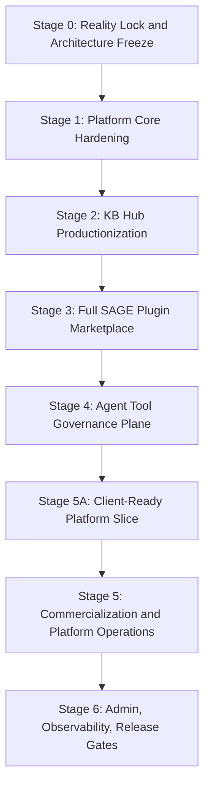

# AgentOS Backend Platform Roadmap

Updated: 2026-06-01
Status: current `main` reality baseline after Stage 5A client-ready gates; federation remains out of current roadmap
Scope: AgentOS Server platform completion, not MVP delivery

## 1. Direction

AgentOS Backend is no longer treated as a sequence of isolated MVP slices. The current target is a complete single-server AgentOS platform with stable architecture, complete data boundaries, governance, auditability, billing, KB Hub, SAGE plugin marketplace, semantic search, object storage, and production operations. Federation / multi-server networking is intentionally removed from the current roadmap until the single-server governance and trust model is mature.

“Step into final form” means:

- architecture boundaries are decided up front;
- platform data model is planned as a whole;
- security/governance/audit are first-class subsystems, not later patches;
- implementation still proceeds in testable stages with fresh verification evidence.

## 2. Current Baseline

Fresh local verification for this baseline:

```text
Backend branch: main
Backend working tree: clean before documentation cleanup
Backend: go test ./...
Result: 189 passed in 11 packages

Backend release gate: ./scripts/release-gate-local.sh
Result: passed

Rust SDK targeted bridge/FFI check: cargo test -p agentos-client-bridge -p agentos-ffi --locked
Result: 18 passed in 6 suites
```

Current backend implementation includes:

- Identity challenge/verify through Ed25519 and the configured signature verifier.
- Rust FFI identity verifier path via `agentos-ffi` / `identity-core`.
- Admission policy foundation and admin admission routes.
- QR-only device pairing.
- Conversation, message persistence, offline message foundation, and WebSocket dispatcher.
- Sync event stream, cursors, per-user sequence allocation, idempotency keys, and pull/ack API.
- Sync object coverage for profile, message, skill, agent, server list, and personal knowledge entries.
- Personal knowledge entry tombstone, version, content hash, idempotency, and optimistic conflict semantics.
- MinIO-backed object storage foundation with `object_records` and upload/complete/download/delete lifecycle.
- KB Hub collection/snapshot publishing, immutable snapshot metadata, manifest/content object storage, public discovery, install/subscription, installed access, fulltext fetch, usage records, billing ledger foundation, contributor earnings foundation, lexical search, and async semantic search pipeline.
- PostgreSQL + pgvector semantic storage, durable embedding queue, deterministic embedding provider, local HTTP embedding worker contract, and Go embedding job worker.
- SAGE Plugin Open Platform control plane, plugin lifecycle sync, object-backed icon/package bindings, Stage 5A runtime contract gates, and governance client error contract gates.
- Skill Hub MVP with registry, immutable manifest versions, basic manifest/package validation, public catalog, user install library, installation sync events, admin takedown, and publisher restriction.

Current known major gaps:

- Skill Hub MVP is implemented; remaining gaps are ratings/download metrics, monetization, richer quality scanning, advanced package inspection, and real client runtime consumption.
- AgentOS Client integration is not complete; Stage 5A backend/SDK contract gates are ready, but product client runtime still needs to consume them end-to-end.
- SAGE Plugin Open Platform backend control plane is implemented; remaining SAGE gaps are real client runtime integration, richer governance scanning, production policy operations, and ecosystem/plugin-server quality.
- Federation / multi-server networking is intentionally out of scope; existing server-list sync remains a local user configuration feature only.
- Governance/policy control plane now has Stage 4D approval-workflow foundation; remaining gaps are richer scanner coverage, policy DSL/conditions, response inspection, frontend/admin UX, first-class admin bootstrap, and production incident workflows.
- Production observability is still incomplete; admin operations, release gates, and background job unification have a foundation, but structured logs, metrics, dashboards, and runbooks remain.
- KB Hub has a productionization foundation; remaining gaps are real payment integration, tax/export operations, renewal collection policy, entitlement revocation policy, and chunk-level search quality.

## 3. Platform Completion Stages



## 4. Stage 0 — Reality Lock and Architecture Freeze

Goal: align code, documentation, migrations, tests, and roadmap before large feature expansion.

Deliverables:

- `docs/platform-roadmap.md`
- `docs/system-capability-matrix.md`
- `docs/architecture-boundaries.md`
- updated README / status references
- clean or intentionally documented git working tree state

Acceptance criteria:

- Current implemented capabilities are documented against real code.
- Planned platform capabilities are listed without pretending they exist.
- Architecture boundaries are explicit.
- Verification commands and current evidence are recorded.

## 5. Stage 1 — Platform Core Hardening

Goal: harden existing identity, sync, WebSocket, and operational foundations into platform-grade primitives.

Primary workstreams:

1. Identity and sensitive operations
   - password setup/change/confirmation;
   - device revoke/rename/trust state;
   - admin bootstrap;
   - admission audit events.

2. Sync completeness
   - plugin lifecycle sync event taxonomy;
   - schema version compatibility policy;
   - sync snapshot/repair API;
   - event compaction and retention strategy.

3. WebSocket and IM completion
   - conversation lifecycle events;
   - attachment-backed rich message types;
   - participant events;
   - Agent participant attribution and cards.

4. Operational baseline
   - request IDs;
   - structured logs;
   - readiness endpoint;
   - background cleanup tasks for pending objects and expired sessions.

## 6. Stage 2 — KB Hub Productionization

Goal: turn KB Hub from a functional subsystem into a governable knowledge economy platform.

Completed Stage 2 foundation:

1. KB governance and moderation
   - source and copyright declarations on collections;
   - collection review statuses: pending, approved, rejected, takedown, archived;
   - admin review/takedown API;
   - user report API;
   - admin moderation report list/resolve API;
   - audit events for review, report, snapshot lifecycle, and subscription expiry.

2. Version lifecycle
   - snapshot status: active / archived;
   - snapshot archive/restore APIs;
   - latest public snapshot ignores archived snapshots;
   - snapshot diff API for added/removed/changed/unchanged entries.

3. Entitlement cleanup foundation
   - subscriptions may carry `expires_at`;
   - expired active subscriptions can be marked expired by service/admin API;
   - installed access continues to require active subscription.

Remaining Stage 2 gaps:

1. Semantic search quality
   - real BGE-M3 worker path live smoke is verified locally via `scripts/smoke-kb-embedding-worker.sh` and `scripts/smoke-kb-semantic-local-http.sh`;
   - remaining work is chunk-level search documents;
   - passage embeddings;
   - hybrid reranking;
   - query logs, feedback, and evaluation fixtures.

2. Billing and entitlements foundation
   - versioned billing plans;
   - free / paid / trial / granted entitlement variants;
   - invoice and invoice item records;
   - refund and dispute records;
   - contributor payout period aggregation;
   - admin invoice paid / refund resolution / dispute resolution / payout paid APIs.

Remaining Stage 2 billing gaps:

- external payment provider integration;
- automated renewal collection policy;
- external payment retry/reconciliation;
- tax/export documents;
- payout dispute and hold policy;
- owner/admin entitlement revocation.

4. Operations
   - unified background job runner for offline message cleanup, sync event cleanup, expired sensitive operation confirmations, KB subscription expiry, and optional in-process KB embedding worker.
   - remaining: persisted job execution history, admin job trigger/list APIs, renewal collection jobs, and future moderation jobs.

## 7. Stage 3 — SAGE Client-Ready Plugin Platform

Goal: move the implemented SAGE backend foundation from control-plane APIs to a client-ready platform slice with runtime contract smoke, multi-device sync semantics, object-backed plugin assets, and release-gated evidence.

Primary workstreams:

1. Runtime contract smoke
   - implemented with `examples/sage-plugins/hotel-booking/mock_server.py` and `scripts/smoke-sage-plugin-runtime.sh`;
   - verified path: create → submit → approve → install → grant → policy bundle → mock flow call → invocation/report → metrics.

2. Plugin state sync
   - implemented events: `plugin.installed`, `plugin.uninstalled`, `plugin.enabled`, `plugin.disabled`, `plugin.permission_granted`, `plugin.permission_revoked`;
   - verified by service tests and `scripts/smoke-sage-plugin-runtime.sh` public sync pull assertions.

3. Plugin assets
   - implemented package/icon object storage using `ObjectService` / MinIO;
   - developer-owned active object validation for icon/package bindings;
   - catalog-safe asset metadata for icon/package records.

4. Governance hardening
   - injection scan and typosquatting scan;
   - capability/risk review quality;
   - admin revoke/suspend operational policy.

5. Reporting and billing integration
   - strengthen execution report ledger idempotency;
   - connect invocation usage to future billing without implementing real payment in this stage.

Non-goal: Backend does not execute third-party SAGE Flow definitions and does not host arbitrary plugin code.

## 8. Stage 4 — Agent Tool Governance Plane

Goal: create the policy/audit/security control plane used by SAGE, KB, object storage, admin operations, billing, and future action systems.

Completed foundation through Stage 4D:

- capability taxonomy via `capability_definitions` and admin create/list APIs;
- policy rules and persisted policy decisions with decisions: allow, require_user_approval, require_admin_approval, deny;
- kill switches by global/plugin/user/capability/server-local scope;
- approval receipts with one-time expiry, actor/subject/capability-bound consume validation, admin revoke, and token reissue with old-token invalidation;
- governance scan result persistence plus admin list/resolve APIs;
- enforcer integration for SAGE grants/invocations, object storage lifecycle, and KB high-impact operations;
- stable machine-readable error codes and error details for denied / approval-required / invalid-approval outcomes;
- admin evidence APIs for policy decisions, approval receipts, scan results, and summary windows;
- live enforce-readiness smoke script and release-gate integration, including approval receipt reissue/revoke checks.

Remaining Stage 4 gaps:

- richer scanner coverage and review quality;
- policy DSL or condition model beyond deterministic simple matching;
- response inspection / unsafe output detection;
- security incident workflow;
- frontend/admin UX for approvals and evidence review;
- first-class admin bootstrap and finer-grained approval operator authorization;
- append-only audit expansion beyond the existing audit hash-chain foundation.

This stage is deliberately placed after SAGE registry design but before allowing broad real tool execution.

## 9. Stage 5A — Client-Ready Platform Slice

Goal: make the already implemented single-server platform stable enough for AgentOS Client / SDK integration before broad commercialization work.

Stable Stage 5A client-facing contracts are consolidated in `docs/stage5a-client-integration-handoff.md`. The previous implementation-plan document was retired after the gates landed on `main`.

Primary workstreams:

- Reality Lock 2.0: keep roadmap, status docs, tests, and architecture boundaries aligned with the real codebase;
- SDK Client Sync Bridge expansion: extend `agentos-client-bridge` / `agentos-ffi` beyond knowledge-only reduction so client projections can consume plugin, skill, agent, server, and knowledge sync events from backend pull envelopes;
- SAGE Client Runtime Contract Gate: freeze policy bundle semantics, verify approval-required / denied governance paths, and keep backend as the control plane rather than a flow executor;
- Release Gate 1.0: include client-ready evidence paths alongside Go tests, migration gate, live object/SAGE/governance smokes, and optional local_http semantic smoke;
- Search-quality follow-up: chunk-level passage retrieval and evaluation fixtures after client contracts are stable;
- Governance 4E follow-up: richer scanner coverage, policy conditions, response inspection, incident workflow, and admin bootstrap.

Exit criteria:

- backend and SDK tests pass with fresh evidence;
- backend sync events have SDK-compatible reducer coverage beyond knowledge-only sync;
- SAGE policy bundle / invocation / report contract is verified by smoke evidence;
- governance enforcement errors remain stable for client consumption;
- release gate records client-ready evidence.

## 10. Stage 5 — Commercialization and Platform Operations

Goal: complete commercial and operational platform capabilities without introducing Federation / multi-server networking.

Primary workstreams:

- external payment provider integration around the internal ledger;
- automated renewal collection and reconciliation policy;
- refund, dispute, payout hold, tax/export operations;
- owner/admin entitlement revocation;
- richer admin dashboards for KB, SAGE, billing, jobs, audit, security, and health;
- production metrics, structured logs, release gates, and operational runbooks;
- search-quality improvements such as chunk-level passage retrieval and evaluation fixtures.

Deferred scope: Federation / multi-server networking remains out of the current roadmap. Do not implement server identity discovery, `.well-known/agentos-server.json`, signed server handshakes, remote plugin discovery, remote KB discovery, or cross-server data synchronization until a later product/security review explicitly reopens this scope.

## 11. Stage 6 — Admin, Observability, Release Gates

Goal: make the backend long-running, governable, and releaseable.

Primary workstreams:

- admin APIs for identity, admission, KB, plugins, billing, jobs, audit, security, and health;
- unified background job system;
- background job run history and admin visibility (`/api/v1/admin/ops/background-job-runs`);
- admin run-once operation for maintenance tasks (`/api/v1/admin/ops/background-jobs/run-once`);
- structured logging and request IDs;
- metrics and readiness;
- migration gate;
- full smoke suite;
- release gate script (`scripts/release-gate-local.sh`) with optional PostgreSQL migration apply gate (`scripts/check-migrations-local.sh`).

Required release checks:

```text
go test ./...
PostgreSQL migration apply check
object storage smoke
KB full smoke
semantic search deterministic smoke
real embedding worker health smoke when enabled
SAGE marketplace smoke
policy governance smoke
governance enforce-readiness smoke, including approval receipt reissue/revoke checks
audit hash-chain smoke
```

## 12. Immediate Next Work

The immediate next implementation target is **Skill Hub hardening + client integration**, while preserving the Stage 5A client-ready contract baseline.

Recommended order:

1. Reality Lock 2.1: keep README, roadmap, capability matrix, and handoff docs aligned with `main`;
2. Skill Hub hardening: richer manifest/package scanning, client install/runtime consumption, quality signals, and optional ecosystem metrics beyond the current registry/catalog/install/admin-governance MVP;
3. AgentOS Client integration against the Stage 5A sync bridge, SAGE runtime contract, and governance error contract;
4. KB chunk-level search quality and Governance 4E production policy operations as follow-up slices;
5. Commercialization/ops: real payments, renewal collection, metrics, structured logs, dashboards, and runbooks.

### Stage 4B/4C/4D Governance Enforcement Integration

Stage 4B wires governance evaluation into SAGE permission grants/invocations, object storage lifecycle operations, and KB high-impact operations. The default mode is `observe`, which records decisions and would-block evidence without interrupting business execution. Operators can later switch global or domain-specific modes to `enforce`.

Stage 4C adds enforce-readiness controls: approval receipts are bound to actor/subject/capability at consume time, SAGE/Object/KB handlers return stable governance error codes, admin APIs expose policy decisions/approval receipts/scan findings/summary evidence, scan findings can be resolved, and `scripts/smoke-governance-enforce-readiness.sh` verifies live enforce-mode denial behavior.

Stage 4D starts the operational approval workflow: enforce errors now include stable details for policy decision/subject/capability/risk context, pending approval receipts can be revoked, pending unexpired receipts can reissue a one-time raw token, old tokens are invalidated on reissue, and revoked/consumed/expired receipts cannot be reissued.
