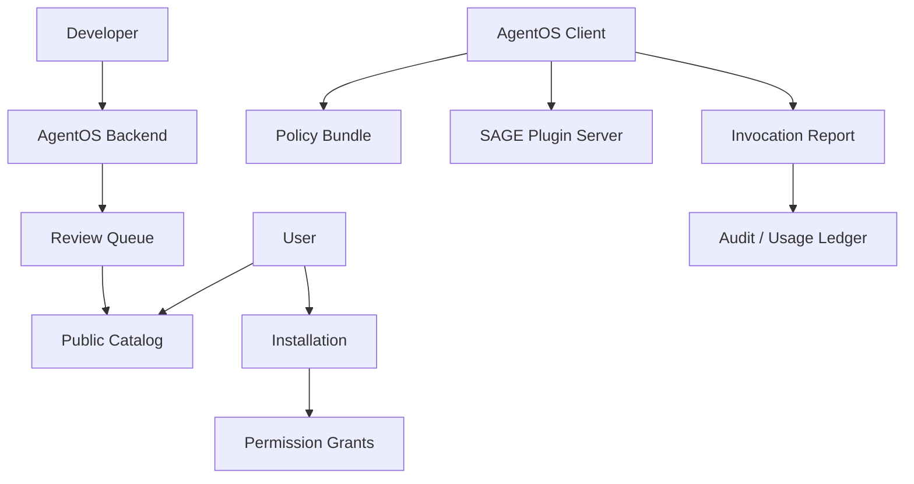

# SAGE Plugin Open Platform Design

## Positioning

AgentOS Backend is the **open platform control plane** for SAGE Plugins. It is analogous to the WeChat Mini Program platform: developers register AI-native plugins, AgentOS reviews and distributes them, users install and grant permissions, and AgentOS Client executes plugin flows on behalf of users.

## Roles

- **AgentOS Backend**: registry, review, catalog, installation, permission grants, policy bundles, invocation reports, audit, usage ledger.
- **AgentOS Client**: intent routing, plugin selection, SAGE flow execution, local LLM/tool execution, user confirmation, privacy enforcement.
- **SAGE Plugin Server**: third-party service that exposes manifest, flow endpoint, callback endpoint, and business APIs.
- **Developer**: owns plugin server, manifest, service quality, support, and commercial policy.

## M4 Scope

M4 builds the backend control plane only:

1. Plugin registry and manifest version submission.
2. Manifest validation, risk inference, and permission summary.
3. Admin review and public catalog.
4. User installation and permission grants.
5. Policy bundle for AgentOS Client.
6. Invocation and execution report ingestion.
7. Usage ledger / developer metrics foundation.
8. Mock runtime contract artifacts.

## Non-goals

- Backend does not execute arbitrary plugin flows.
- Backend does not host third-party plugin code.
- Backend does not proxy all plugin runtime traffic by default.
- Backend does not implement real payment settlement in M4.

## Control Plane Flow

## Backend Truth Sources

- PostgreSQL stores plugin lifecycle, review, install, grants, policy snapshots, invocations, reports, usage ledger.
- Redis is not a business truth source.
- MinIO/object storage may store raw manifest/icon/package assets later, but M4 stores manifest JSON snapshots in PostgreSQL.
