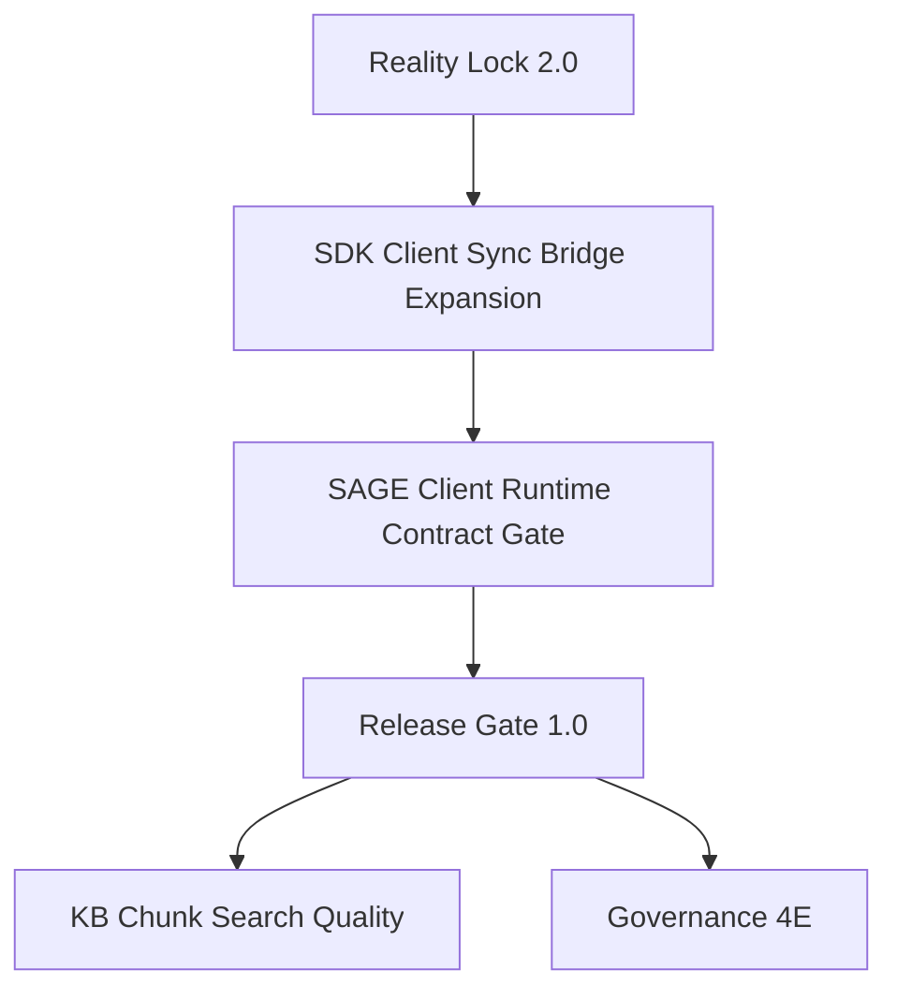

# Stage 5A — Client-Ready Platform Slice

Updated: 2026-06-01
Branch: `stage5a-client-ready-platform-slice`
Status: in progress — sync bridge evidence path implemented

## 1. Purpose

Stage 5A turns the already implemented single-server AgentOS Backend platform into a client-ready slice. The goal is not to add another broad backend subsystem. The goal is to make the existing identity, sync, KB Hub, SAGE Plugin Open Platform, object storage, governance, and release-gate surfaces stable enough for AgentOS Client / SDK integration.

Success means an AgentOS Client can connect to the backend, authenticate, consume sync events through SDK-compatible reducers, install and authorize SAGE plugins, fetch policy bundles, report runtime execution, access KB Hub resources, and receive stable governance errors with evidence-backed release checks.

## 2. Current Verified Baseline

Fresh local verification on 2026-06-01:

```text
Backend: go test ./...
Result: 183 passed in 11 packages

Rust SDK: cargo test --workspace --all-targets --locked
Result: 1560 passed, 2 ignored, 110 suites
```

Backend branch at Stage 5A start:

```text
main -> stage5a-client-ready-platform-slice
```

Backend already includes:

- Ed25519 challenge/verify and Rust FFI identity verifier;
- admission policy and QR-only device pairing;
- WebSocket messaging, offline message foundation, sync pull/ack, per-user monotonic sequence, idempotency keys;
- profile/message/skill/agent/server/personal-knowledge sync events;
- MinIO-backed object storage lifecycle;
- KB Hub publishing, install/access, usage/billing foundation, semantic search, BGE-M3 local worker contract;
- SAGE Plugin Open Platform registry, manifest validation, review/catalog, install/grants, policy bundle, invocation/report, metrics, plugin sync events, icon/package object binding;
- Governance Stage 4D: capabilities, policy rules, kill switches, policy decisions, approval receipts with revoke/reissue, scanner findings, stable enforcement error details;
- release gate script with optional live smokes.

## 3. Non-goals

Stage 5A does not:

- implement Federation / multi-server networking;
- execute third-party SAGE Flow definitions inside the backend;
- host arbitrary third-party plugin code;
- integrate real external payment providers;
- replace the existing Go business orchestration with Rust business logic;
- expand FFI beyond stable, narrow, client-facing contracts.

## 4. Workstreams

### 4.1 Reality Lock 2.0

Goal: keep roadmap/status docs aligned with the actual codebase and verified evidence.

Deliverables:

- update roadmap baseline and stage graph to include Stage 5A;
- update status docs to stop pointing to already-completed Stage 3A tasks as the next milestone;
- record current backend and SDK verification evidence;
- keep architecture boundaries explicit: FFI-only Rust integration, single-server scope, Backend-as-control-plane for SAGE.

Acceptance checks:

```bash
go test ./...
./scripts/release-gate-local.sh
```

SDK evidence:

```bash
cargo test --workspace --all-targets --locked
```

### 4.2 SDK Client Sync Bridge Expansion

Goal: make backend sync events consumable by AgentOS Client through SDK-compatible typed projections.

Implemented foundation:

- `agentos-client-bridge` exposes a general sync pull response parser and `ClientReadySyncProjection`.
- `agentos-ffi` exports `agentos_apply_sync_pull_response_json` for native clients.
- Backend fixture `internal/service/testdata/stage5a_client_ready_sync_pull_response.json` covers profile, message, skill, agent, server, plugin lifecycle/permissions, and knowledge create/update/delete events.
- Backend integration test `TestFFIClientReadySyncBridgeIntegration` validates the bundled FFI reducer output.
- Smoke script `scripts/smoke-stage5a-sync-bridge.sh` is included in `scripts/release-gate-local.sh`.

Acceptance checks:

```bash
cargo test -p agentos-client-bridge -p agentos-ffi --locked
go test ./...
./scripts/smoke-stage5a-sync-bridge.sh
```

### 4.3 SAGE Client Runtime Contract Gate

Goal: prove that the backend control plane emits enough contract data for AgentOS Client to execute SAGE Plugin runtime flows safely.

Deliverables:

- freeze policy bundle client-facing field names and semantics;
- extend the mock plugin runtime smoke to include approval-required and denied governance scenarios;
- verify plugin install/grant/revoke sync events in the same client contract path;
- verify invocation/report idempotency and developer metrics consistency.

Acceptance checks:

```bash
./scripts/smoke-sage-plugin-runtime.sh
./scripts/smoke-governance-enforce-readiness.sh
```

### 4.4 Release Gate 1.0

Goal: make local release evidence repeatable before broader client integration.

Deliverables:

- keep `scripts/release-gate-local.sh` as the primary local gate;
- keep the Stage 5A sync bridge smoke in the fast release path;
- document optional live gates clearly: migration apply, object storage, SAGE runtime, governance enforcement, local_http semantic search;
- produce release evidence with commit hashes and test results.

Acceptance checks:

```bash
./scripts/release-gate-local.sh
RUN_MIGRATION_GATE=1 RUN_LIVE_SMOKES=1 RUN_LOCAL_HTTP_SEMANTIC=1 ./scripts/release-gate-local.sh
```

### 4.5 Search Quality Follow-up

Goal: improve KB retrieval quality after client-ready contracts are stable.

Deferred but next after Stage 5A contract gate:

- chunk-level search documents;
- passage embeddings;
- hybrid reranking;
- query logs, feedback, and retrieval evaluation fixtures.

This is a quality slice, not a provider-architecture rewrite. BGE-M3 + pgvector + durable queue remain the baseline.

### 4.6 Governance 4E Follow-up

Goal: move governance from enforce-ready foundation to production policy operations.

Deferred but important:

- richer scanner coverage: prompt injection, typosquatting, suspicious endpoints, overbroad permissions;
- first version of policy conditions beyond deterministic matching;
- response inspection / unsafe output detection;
- security incident workflow;
- admin bootstrap and approval operator authorization.

## 5. Recommended Implementation Order



## 6. Stage 5A Exit Criteria

Stage 5A is complete when:

1. roadmap/status docs reflect real backend and SDK progress;
2. backend sync events have SDK-compatible reducer coverage beyond knowledge-only sync;
3. SAGE policy bundle / invocation / report contract is verified by smoke evidence;
4. governance approval-required / denied / invalid-approval responses are stable and documented for client consumption;
5. release gate includes the client-ready evidence path;
6. `go test ./...` and SDK workspace tests pass with fresh output.
