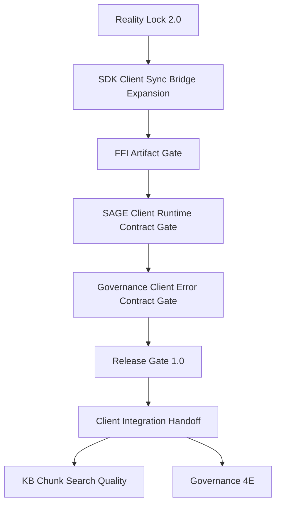

# Stage 5A — Client-Ready Platform Slice

Updated: 2026-06-01
Branch: `stage5a-client-ready-platform-slice`
Status: in progress — Release Gate 1.0 evidence path implemented

## 1. Purpose

Stage 5A turns the already implemented single-server AgentOS Backend platform into a client-ready slice. The goal is not to add another broad backend subsystem. The goal is to make the existing identity, sync, KB Hub, SAGE Plugin Open Platform, object storage, governance, and release-gate surfaces stable enough for AgentOS Client / SDK integration.

Success means an AgentOS Client can connect to the backend, authenticate, consume sync events through SDK-compatible reducers, install and authorize SAGE plugins, fetch policy bundles, report runtime execution, access KB Hub resources, and receive stable governance errors with evidence-backed release checks.

## 2. Current Verified Baseline

Fresh local verification on 2026-06-01:

```text
Backend: go test ./...
Result: 189 passed in 11 packages

Backend release gate: ./scripts/release-gate-local.sh
Result: Release gate local checks passed.

Stage 5A evidence: ./scripts/stage5a-release-evidence.sh
Result: writes tmp/stage5a-release-evidence.md after passing core Stage 5A gates.

Rust SDK targeted bridge/FFI check: cargo test -p agentos-client-bridge -p agentos-ffi --locked
Latest known result: 18 passed, 6 suites
```

Backend branch at Stage 5A start:

```text
main -> stage5a-client-ready-platform-slice
```

Backend already includes:

- Ed25519 challenge/verify and Rust FFI identity verifier;
- admission policy and QR-only device pairing;
- WebSocket messaging, offline message foundation, sync pull/ack, per-user monotonic sequence, idempotency keys;
- profile/message/skill/agent/server/personal-knowledge sync events;
- MinIO-backed object storage lifecycle;
- KB Hub publishing, install/access, usage/billing foundation, semantic search, BGE-M3 local worker contract;
- SAGE Plugin Open Platform registry, manifest validation, review/catalog, install/grants, policy bundle, invocation/report, metrics, plugin sync events, icon/package object binding;
- Governance Stage 4D: capabilities, policy rules, kill switches, policy decisions, approval receipts with revoke/reissue, scanner findings, stable enforcement error details;
- release gate script with optional live smokes.

## 3. Non-goals

Stage 5A does not:

- implement Federation / multi-server networking;
- execute third-party SAGE Flow definitions inside the backend;
- host arbitrary third-party plugin code;
- integrate real external payment providers;
- replace the existing Go business orchestration with Rust business logic;
- expand FFI beyond stable, narrow, client-facing contracts.

## 4. Workstreams

### 4.1 Reality Lock 2.0

Goal: keep roadmap/status docs aligned with the actual codebase and verified evidence.

Deliverables:

- update roadmap baseline and stage graph to include Stage 5A;
- update status docs to stop pointing to already-completed Stage 3A tasks as the next milestone;
- record current backend and SDK verification evidence;
- keep architecture boundaries explicit: FFI-only Rust integration, single-server scope, Backend-as-control-plane for SAGE.

Acceptance checks:

```bash
go test ./...
./scripts/release-gate-local.sh
```

SDK evidence:

```bash
cargo test --workspace --all-targets --locked
```

### 4.2 SDK Client Sync Bridge Expansion

Goal: make backend sync events consumable by AgentOS Client through SDK-compatible typed projections.

Implemented foundation:

- `agentos-client-bridge` exposes a general sync pull response parser and `ClientReadySyncProjection`.
- `agentos-ffi` exports `agentos_apply_sync_pull_response_json` for native clients.
- Backend fixture `internal/service/testdata/stage5a_client_ready_sync_pull_response.json` covers profile, message, skill, agent, server, plugin lifecycle/permissions, and knowledge create/update/delete events.
- Backend integration test `TestFFIClientReadySyncBridgeIntegration` validates the bundled FFI reducer output.
- Smoke script `scripts/smoke-stage5a-sync-bridge.sh` is included in `scripts/release-gate-local.sh`.

Acceptance checks:

```bash
cargo test -p agentos-client-bridge -p agentos-ffi --locked
go test ./...
./scripts/smoke-stage5a-sync-bridge.sh
```

### 4.3 FFI Artifact Gate

Goal: prevent bundled Rust FFI runtime drift from silently breaking Go/backend and native client contract tests.

Implemented foundation:

- `scripts/check-ffi-artifacts.sh` validates bundled Darwin ARM64 and Linux ARM64 artifact presence and architecture.
- The artifact gate requires the exported symbol set:
  - `agentos_ffi_version`
  - `agentos_ffi_free_string`
  - `agentos_identity_verify_ed25519_challenge`
  - `agentos_apply_knowledge_sync_events_json`
  - `agentos_apply_knowledge_sync_pull_response_json`
  - `agentos_apply_sync_pull_response_json`
- `TestFFIArtifactContractIntegration` loads the current-platform bundled artifact and verifies FFI version `0.1.0` plus bridge symbol registration.
- `scripts/release-gate-local.sh` runs the artifact gate before sync bridge smoke tests.

Acceptance checks:

```bash
./scripts/check-ffi-artifacts.sh
./scripts/release-gate-local.sh
```

### 4.4 SAGE Client Runtime Contract Gate

Goal: prove that the backend control plane emits enough contract data for AgentOS Client to execute SAGE Plugin runtime flows safely.

Implemented foundation:

- `docs/sage-plugin-runtime-contract.md` defines the Stage 5A client runtime contract for policy bundle, Plugin Server flow call, invocation, execution report, and governance errors.
- `TestSAGEPluginServiceClientRuntimeContract` verifies policy bundle identity fields, granted/denied permission split, runtime guards, stable reporting endpoint, invocation/report idempotency, and developer metrics.
- `TestSAGEPluginServiceGovernanceEnforceClientRuntimeOutcomes` verifies SAGE enforce-mode denied, approval-required, invalid-approval, and approval-token retry success outcomes.
- `scripts/check-sage-client-runtime-contract.sh` provides a fast service-level gate.
- `scripts/release-gate-local.sh` runs the SAGE contract gate in the default local release path; live smoke remains optional through `RUN_LIVE_SMOKES=1`.

Acceptance checks:

```bash
./scripts/check-sage-client-runtime-contract.sh
./scripts/smoke-sage-plugin-runtime.sh
./scripts/smoke-governance-enforce-readiness.sh
```

### 4.5 Governance Client Error Contract Gate

Goal: keep client UX stable when backend governance denies, requests approval, or invalidates a request.

Implemented foundation:

- `docs/governance-client-error-contract.md` defines the HTTP-level error envelope, stable codes, details fields, client actions, and evidence path.
- `TestGovernanceHandlerClientErrorContract` verifies `403 governance_denied`, `428 governance_approval_required`, and `403 governance_approval_invalid` response shapes.
- `scripts/check-governance-client-error-contract.sh` provides a fast handler-level contract gate.
- `scripts/release-gate-local.sh` runs the governance client error contract gate in the default local release path.

Remaining extension:

- add dedicated kill-switch client UX scenarios if/when kill-switch errors diverge from the standard `governance_denied` envelope.

Acceptance checks:

```bash
./scripts/check-governance-client-error-contract.sh
./scripts/smoke-governance-enforce-readiness.sh
```

### 4.6 Release Gate 1.0

Goal: make local release evidence repeatable before broader client integration.

Implemented foundation:

- `scripts/release-gate-local.sh` remains the primary default local gate.
- The default release gate now includes Go tests, syntax checks, FFI artifact checks, Stage 5A sync bridge smoke, SAGE client runtime contract gate, and governance client error contract gate.
- `scripts/stage5a-release-evidence.sh` runs the core Stage 5A gate set and writes a markdown evidence report with branch, commit, command, result, and per-gate log paths.
- `docs/stage5a-client-integration-handoff.md` summarizes stable client-facing contracts and the recommended client integration order.
- Optional live gates remain explicit: migration apply, object storage, SAGE runtime, governance enforcement, local_http semantic search.

Acceptance checks:

```bash
./scripts/stage5a-release-evidence.sh
./scripts/release-gate-local.sh
RUN_MIGRATION_GATE=1 RUN_LIVE_SMOKES=1 RUN_LOCAL_HTTP_SEMANTIC=1 ./scripts/release-gate-local.sh
```

### 4.7 Search Quality Follow-up

Goal: improve KB retrieval quality after client-ready contracts are stable.

Deferred but next after Stage 5A contract gate:

- chunk-level search documents;
- passage embeddings;
- hybrid reranking;
- query logs, feedback, and retrieval evaluation fixtures.

This is a quality slice, not a provider-architecture rewrite. BGE-M3 + pgvector + durable queue remain the baseline.

### 4.8 Governance 4E Follow-up

Goal: move governance from enforce-ready foundation to production policy operations.

Deferred but important:

- richer scanner coverage: prompt injection, typosquatting, suspicious endpoints, overbroad permissions;
- first version of policy conditions beyond deterministic matching;
- response inspection / unsafe output detection;
- security incident workflow;
- admin bootstrap and approval operator authorization.

## 5. Recommended Implementation Order



## 6. Stage 5A Exit Criteria

Stage 5A is complete when:

1. roadmap/status docs reflect real backend and SDK progress;
2. backend sync events have SDK-compatible reducer coverage beyond knowledge-only sync;
3. bundled FFI artifacts have required architecture, version, and exported symbol evidence;
4. SAGE policy bundle / invocation / report contract is verified by smoke evidence;
5. governance approval-required / denied / invalid-approval responses are stable and documented for client consumption;
6. release gate includes the client-ready evidence path;
7. `go test ./...` and SDK workspace tests pass with fresh output.
